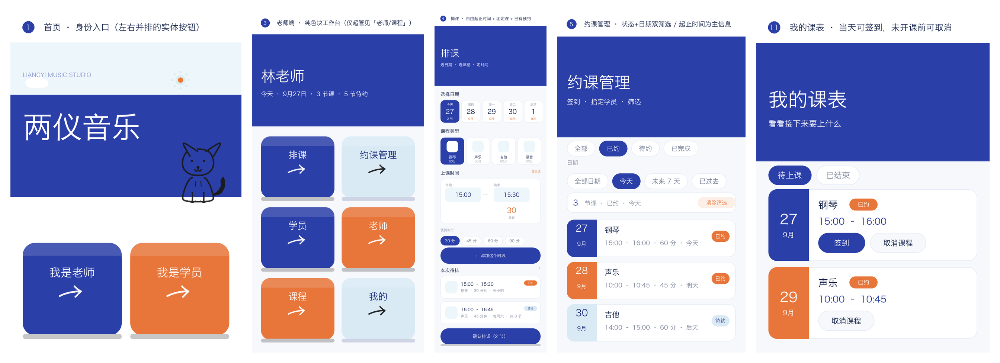

# 两仪音乐工作室 · 微信小程序

单个工作室自用的**排课 / 约课 / 课时台账**工具。老师排课、学员约课、签到核销、课时算清。
原生小程序（WXML / WXSS / JS），无第三方框架；接微信云开发零服务器成本。



---

## ✨ 已实现功能

**老师端**

- **排课**：自由选起止时间（30 分钟试课也能表达）、快捷时长、一次添加多个时段
- **固定课**：每周 / 隔周 × 4/8/12/24 节，一次排完一个季度，逐节带 `1/8` 节次标记，撞期那一周自动跳过并说明原因
- **冲突校验**：同课程类型时间互斥（不同类型可由不同老师并行）、同一学员跨类型互斥；部分成功，冲突逐条列原因
- **指定学员**：排课时直接勾选（支持多选，小组课），或事后在约课管理里补
- **约课管理**：状态 × 日期双维筛选（默认「今天」）、签到、取消、删除
- **学员管理**：搜索、增删改；可录入**共报节数 / 已上节数 / 报名起止日期**（上线时导老学员用）
- **老师管理**（仅超管）：登记老师、删除、授予「工作室资料」编辑权限
- **课程类型**（仅超管）：默认钢琴 / 声乐 / 吉他 / 录音，可增删改 + 从 9 个手绘图标里选，改完全站立即生效
- **工作室资料**：名称、介绍、电话、微信、地址、开放时间

**学员端**

- **约课**：按课程筛选可约时段，一键预约
- **我的课表**：待上课 / 已结束；当天的课可**自助签到**，距开课 > 6 小时可**自助取消**（不足则引导联系老师并一键复制电话）
- **上课记录**：课时档案卡（共报 / 已上 / 剩余 + 进度条 + 报名周期）+ 时间轴；超支显示红色「已超 N 节」

**通用**：手机号即身份（老师无需邀请码与注册）、超管/普通老师权限分层、本地模式与云开发双写、无 tabbar 的色块导航。

---

## 🎨 UI 设计

以工作室名「两仪」为意象：师与生、排课与约课，两端相生。**极简大色块 + 手绘线条插画**，钴蓝与白占绝对主导。

| 角色 | 色值 | 用途 |
|---|---|---|
| 钴蓝 | `#2B3FA8` / `#1E2E7A` | 主色块、导航、主按钮、选中态 |
| 白 | `#FFFFFF` / `#F6F8FC` | 主底、页面背景 |
| 陶土橙 | `#E8763A` | 中等面积点缀：次级色块、「已约」标签 |
| 淡天空蓝 | `#D9EAF5` / `#EDF6FB` | 小面积过渡、「待约」标签 |
| 砖红 | `#C0392B` | **仅用于课时超支告警** |

- 功能入口一律是**可以按下去的实体色块**：硬阴影 `0 16rpx 0` + 按下位移 16rpx + 顶部高光，块内只有标题与卡通箭头
- 无底部 tabbar，`navigationStyle: custom`，首页即工作台
- 吉祥物：**黑色线条手绘约克夏**（工作室的狗），骑跨首页色带交界，纯色平涂无上色
- 纯色平涂，零渐变、零阴影（实体按钮的厚度除外）、零 `filter`
- 文案克制：不放标语与装饰性提示语

---

## 📚 详细文档

| 文档 | 内容 |
|---|---|
| [**docs/PRD.md**](./docs/PRD.md) | 产品需求：背景与目标、角色画像、5 个核心场景、信息架构、**逐页需求 + 19 张原型图**、业务规则、里程碑、验收清单 |
| [**docs/详细设计文档.md**](./docs/详细设计文档.md) | 技术方案选型、角色与权限矩阵、前端 UI 设计、数据库设计、后端接口设计、异常边界设计 |
| [docs/踩坑与优化记录.md](./docs/踩坑与优化记录.md) | 开发中真实踩到并修掉的问题：症状 → 成因 → 解法 → 教训 |
| [docs/mockups/](./docs/mockups/) | 全部原型图（与代码同源渲染，改样式后重跑 `tools/build_prd_assets.py`） |
| [云开发接入.md](./云开发接入.md) | 从本地模式切到云开发的六步操作 |

---

## 🚀 快速开始

1. 微信开发者工具 → 导入项目 → 选择本目录（基础库 ≥ 3.17.3）
2. **换成你自己的 AppID**：`project.config.json` 里带的是原作者的，选「测试号」也能跑
3. **不接云开发即可完整体验**：数据走本地缓存 + 内置种子数据，增删改查全部可用
4. 要接云开发（多人共用一份数据）：照 [云开发接入.md](./云开发接入.md) 六步走，唯一开关是 `utils/config.js` 的 `CLOUD_ENV`
5. 改完代码跑一下静态校验：`python3 tools/check_project.py`（CI 每次 push 自动跑）

### 开发期测试账号

登录页手机号下方有测试卡，点一下即填入（学员账号可一步登录）。
上线前把 `pages/login/login.js` 顶部的 `DEV_MODE` 改为 `false` 即可隐藏。

| 身份 | 姓名 | 手机号 |
|---|---|---|
| 老师（超级管理员） | 林老师 | `13800000000` |
| 老师（普通） | 苏老师 | `13900000001` |
| 学员 | 张小明 等 | `13500000001` ~ `13500000005` |

> 仓库里的老师、学员、手机号、地址**全部是虚构种子数据**，用于本地演示。

---

## 📂 目录结构

```
├── app.js / app.json / app.wxss     # 全局；设计令牌与共享组件集中在 app.wxss
├── pages/
│   ├── index · login · profile      # 身份入口 / 登录 / 我的
│   ├── teacher/                     # home · schedule · bookings · students
│   │                                # · teachers · course-types · studio
│   └── student/                     # home · book · schedule · records
├── utils/                           # courses · students · teachers · lessons
│                                    # · quota · studio · date · dialog · cloudkit · config
├── cloudfunctions/                  # login · sync · admin（服务端权限校验）
├── assets/ images/                  # 插画源文件与导出的 PNG
├── tools/                           # 原型图生成脚本 + check_project.py 静态校验
└── docs/                            # PRD · 详细设计 · 踩坑记录 · mockups/
```

---

## ☁️ 当前状态

| 项 | 状态 |
|---|---|
| 14 个页面与全部业务规则 | ✅ 本地模式完整可用 |
| 云开发双写架构（本地优先 + 防抖差分同步） | ✅ 代码就绪，⏳ 待填环境 ID 并部署 |
| 备案 / 隐私指引 / 提审 | ⏳ 待办 |

## 🔜 可扩展方向

固定课整组管理（停某周 / 往后全取消）、上课提醒（订阅消息）、一对一与小组课区分、消课与课时包售卖。

---

## 📄 License

[MIT](./LICENSE) © 2026 yuwhitehat
