# 两仪音乐工作室小程序 · 产品需求文档（PRD）

| 项 | 内容 |
|---|---|
| 产品名称 | 两仪音乐工作室 |
| 载体 | 微信小程序 |
| 文档版本 | v1.1（2026-09-27） |
| 状态 | 开发中（本地模式已可完整体验，云端接入待启动） |
| 读者 | 工作室主理人、开发、设计、测试 |

---

## 一、产品概述

### 1.1 背景

朋友的个人独立音乐工作室【两仪音乐】目前是线下约课，前两个月聊天时说起想做一个约课的小程序，于是我刚好拿来用于AI练手，做一个专属小程序给工作室。

### 1.2 产品目标

做一个**只服务于单个工作室**的轻量小程序，解决三件事：

| 目标 | 衡量方式 |
|---|---|
| 老师 30 秒排完一节课 | 排课主流程点击数 ≤ 6 次 |
| 学员能自助看课、约课、查课时 | 学员端无需老师介入即可完成约课 |
| 课时账目清楚，不再算错 | 超支自动标红并提醒老师 |

### 1.3 非目标（明确不做）

- ❌ 多校区 / 多门店管理
- ❌ 在线支付与课程包售卖（现阶段线下收款）
- ❌ 招生营销、拼团、分销
- ❌ 作业批改、家校互动、课堂点评
- ❌ 视频回放、在线上课

### 1.4 设计语言

- **主色**：钴蓝 + 白，占绝对主导
- **点缀**：陶土橙，中等面积（次级入口、状态标签）
- **辅助**：淡天空蓝，小面积过渡
- **吉祥物**：黑色线条手绘约克夏（工作室的狗），配盆栽、乐器等线条插画
- **交互母题**：功能入口一律是**可以按下去的实体色块**（硬阴影 + 按下位移），
  不用底部导航栏，首页即工作台

---

## 二、用户与场景

### 2.1 角色画像

| 角色 | 谁 | 主要诉求 | 使用频率 |
|---|---|---|---|
| **超级管理员** | 工作室主理人（老师本人） | 管理其他老师、定义课程、看全局 | 每天 |
| **老师** | 工作室授课老师 | 快速排课、知道谁来了、算清课时 | 每天多次 |
| **学员 / 家长** | 上课的人或其家长 | 看什么时候有课、约课、还剩几节 | 每周 |

> 前期现实情况：**约课动作大多仍在微信上完成**，老师只是把结果录进系统。
> 因此产品必须支持"老师替学员指定学员"这条路径，而不是强依赖学员自助约课。

### 2.2 核心场景

**场景 A｜老师排下周的课，并直接填上学生**
> 林老师周日整理课表，打开小程序 → 排课 → 选 10 月 3 日 → 选「钢琴」→
> 时间 15:00–16:00 → 打开「已有学员预约」→ 勾选张小明 → 添加 → 确认。
> 这节课直接是「已约」状态，不用等学员来约。

**场景 B｜固定每周课，一次排完一个季度**
> 陈佳怡每周六 15:00 上课，一直上到年底。老师排课时选「重复 = 每周」、
> 「上几节 = 12」，界面立刻预览「每周六 15:00 起，共 12 节，到 X 月 X 日」，
> 确认一次生成 12 节课，每节标着 1/12、2/12。撞期的那一周自动跳过并说明原因。

**场景 C｜学员自助约课**
> 家长想知道周末还有没有空位，打开小程序 → 约课 → 按「钢琴」筛选 →
> 看到 10 月 3 日 15:00–15:45 可约 → 点「约」→ 确认。老师端同步变为「已约」。

**场景 D｜临时有事要取消**
> 学员距开课还有 3 小时想取消 → 系统拒绝并提示「不足 6 小时，请联系老师」，
> 弹窗里直接给出老师电话和一键复制。老师端取消则不受时间限制。

**场景 E｜课时算不清**
> 上线前张小明已上了 8 节、共报 12 节。老师在学员页录入这两个数，
> 之后在小程序里每签到一次，「已上」自动 +1。若上超了，
> 学员端显示红色「已超 N 节」，老师签到当场也会收到提醒。

---

## 三、产品信息架构

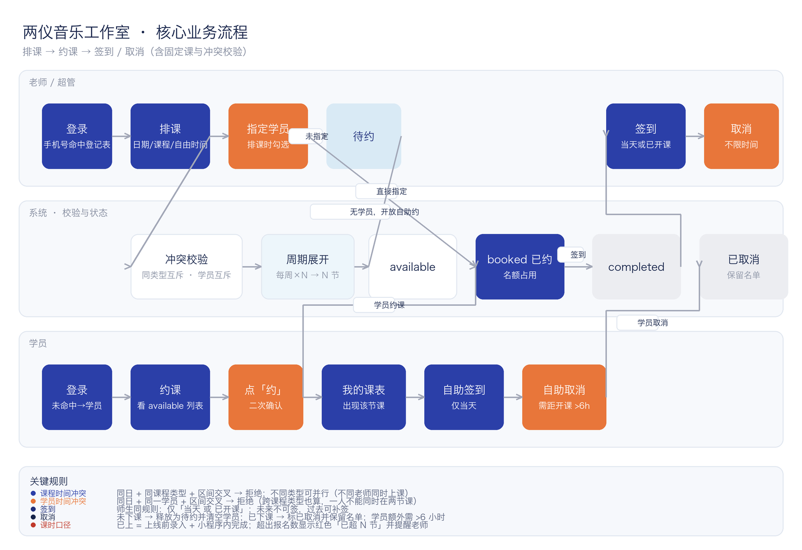

```
首页（身份入口）
├── 老师入口
│   ├── 登录
│   ├── 工作台 ──┬── 排课
│   │            ├── 约课管理
│   │            ├── 学员
│   │            ├── 老师        （仅超管）
│   │            ├── 课程类型    （仅超管）
│   │            └── 我的 ──┬── 关于 / 联系
│   │                       └── 工作室信息（需授权）
└── 学员入口
    ├── 登录
    ├── 工作台 ──┬── 约课
                 ├── 我的课表
                 ├── 上课记录
                 └── 我的
```

**导航原则**：无底部 tabbar。首页即工作台，功能是一个个可点击的色块；
进入子页后用左上角返回键回到上一页。

---

## 四、页面需求详述

### 4.1 首页 · 身份入口


| 元素 | 说明 |
|---|---|
| 顶部品牌区 | 钴蓝主带 + "两仪音乐"，约克夏线条狗骑跨色带交界 |
| 「我是老师」 | 钴蓝实体色块，点击进入老师登录 |
| 「我是学员」 | 陶土橙实体色块，点击进入学员登录 |

**交互**：色块按下时整块下沉、底部阴影压扁，像按下一个真实按钮。
**规则**：已登录用户再次进入首页，自动前往对应工作台。

---

### 4.2 登录页

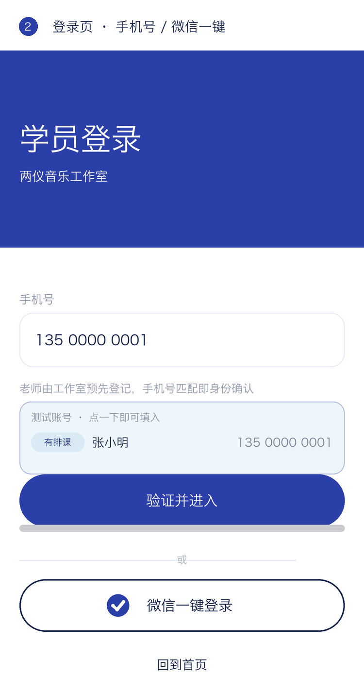

**老师登录只需手机号**——工作室老师由管理员预先登记，手机号命中即确认身份，
姓名取自登记表。**不需要邀请码，不需要填姓名。**

| 方式 | 说明 |
|---|---|
| 手机号验证 | 输入 → 系统查登记表 → 命中进老师端，未命中转学员流程 |
| 微信一键登录 | 用微信手机号快速验证组件（需非个人主体 + 认证） |

**学员**：手机号未命中登记表时，才需要补一次姓名（老师课表要显示是谁）。

**开发期测试卡**：登录页会列出当前身份对应的测试账号，点一下即填入；
学员账号点一下可**直接登录**（连姓名一起填好）。上线前通过开关隐藏。

---

### 4.3 老师端工作台


| 色块 | 配色 | 可见角色 |
|---|---|---|
| 排课 | 钴蓝 | 全部老师 |
| 约课管理 | 浅蓝 | 全部老师 |
| 学员 | 钴蓝 | 全部老师 |
| 老师 | 陶土橙 | **仅超级管理员** |
| 课程 | 陶土橙 | **仅超级管理员** |
| 我的 | 浅蓝 | 全部老师 |

**规则**：色块只有标题 + 卡通箭头，不放图标圆圈、不放说明小字、不放装饰插画。
超管 6 块正好三行两列；普通老师 4 块两行两列，均无空缺。

---

### 4.4 排课 ⭐ 核心功能

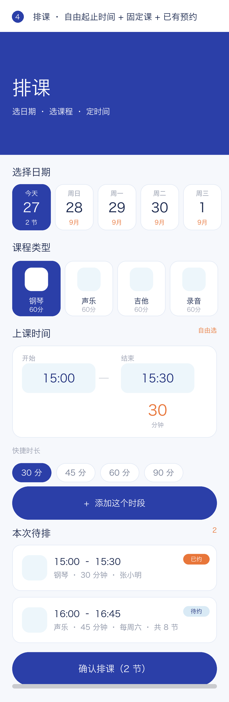

**流程**：选日期 → 选课程 → 定时间 →（可选）指定学员 → 添加时段 →（可重复）→ 确认排课

| 模块 | 需求 |
|---|---|
| 日期 | 未来 14 天横向选择；有课的日期显示已排节数 |
| 课程类型 | 读「课程类型」配置，显示图标 + 名称 + 默认时长；选中后结束时间按默认时长自动填 |
| **时间** | **自由选起止时间**，不用固定小时格。30 分钟试课、90 分钟大课都能表达 |
| 快捷时长 | 30 / 45 / 60 / 90 分一键设置，按开始时间推算结束 |
| 固定课 | 重复 = 不重复 / 每周 / 隔周；次数 = 4 / 8 / 12 / 24；实时预览"每周六 15:00 起，共 8 节，到 11月14日" |
| 已有预约 | 开关打开后弹出学员多选，该节课直接置为「已约」 |
| 待排列表 | 可继续添加多个时段，可逐条删除；单节课添加后开始时间自动顺延，方便连排 |

**冲突校验（产品规则，详见第五章）**

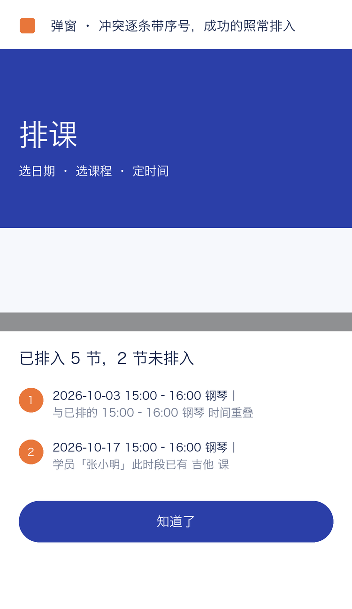

- 同一**课程类型**时间互斥；不同类型可并行（不同老师可同时上课）
- 同一**学员**时间互斥，跨课程类型也算
- 部分成功：排入的正常写入，被拦的**逐条带序号**列出原因

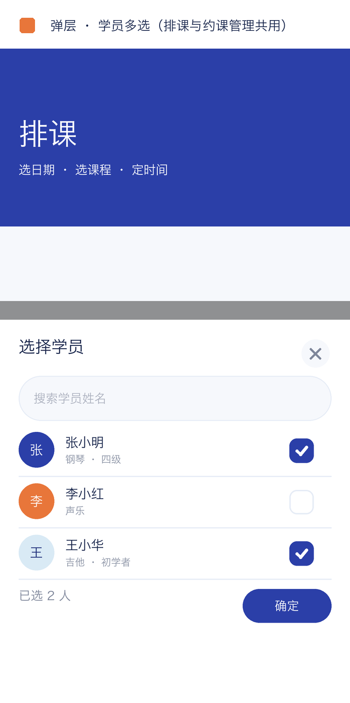

---

### 4.5 约课管理

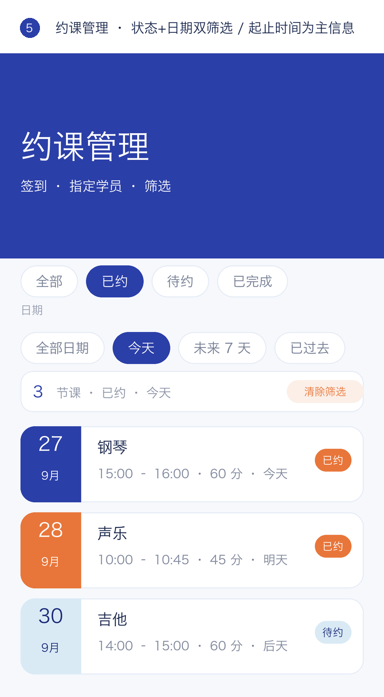

**双维筛选**（组合生效）

```
状态  全部 / 已约 / 待约 / 已完成
日期  全部日期 / 今天（默认）/ 未来 7 天 / 已过去 / 指定某天
```
筛选非默认时出现「清除筛选」；结果计数条实时显示当前条件与节数。

**课卡信息层级**：起止时间是**主信息**（加粗钴蓝），配时长徽标与相对日期；
固定课显示节次（1/8）。

**操作按钮**（每行最多两个，按状态收敛）

| 课程状态 | 可执行操作 |
|---|---|
| 待约 | 指定学员 · 删除 |
| 已约 | 签到（需当天或已开课）· 取消课程 |
| 已完成 / 已取消 | 删除 |

**取消的两种结果**（关键设计）

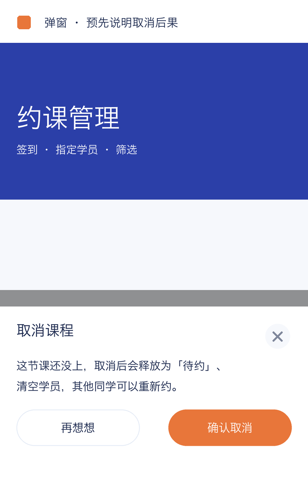

| 情形 | 结果 | 为什么这样设计 |
|---|---|---|
| 课**还没上** | 释放为「待约」、清空学员 | 这节课重新开放，别人还能约；若显示"已取消+没人约"会让人误以为这节课没了 |
| 课**已结束** | 标记「已取消」但**保留学员名单** | 历史要能查是谁上的，否则对账时变成一条无名记录 |

确认弹窗会**预先说明会发生什么**，不让用户猜。

---

### 4.6 学员管理

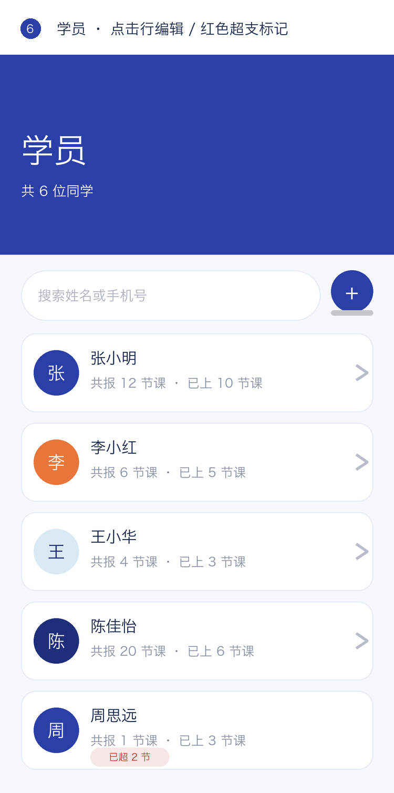

列表行只显示**共报 X 节课 · 已上 X 节课**（不显示"待上"和"备注"，
因为备注可能很长会把行撑乱）。超支时追加红色「已超 N 节」标记。

点击任意行进入编辑弹层，可维护：姓名、手机号、**共报节数**、**已上节数**、
**报名起止日期**（选填）、备注。

> 这是为**上线时录入老学员**设计的：老师手上有历史数据但系统里没有，
> 必须能直接填进去。表单里的"已上"填的是**总已上**（与列表口径一致），
> 系统内部再换算，之后在小程序里签到的课会自动累加，不用回头改数字。

---

### 4.7 老师管理（仅超管）

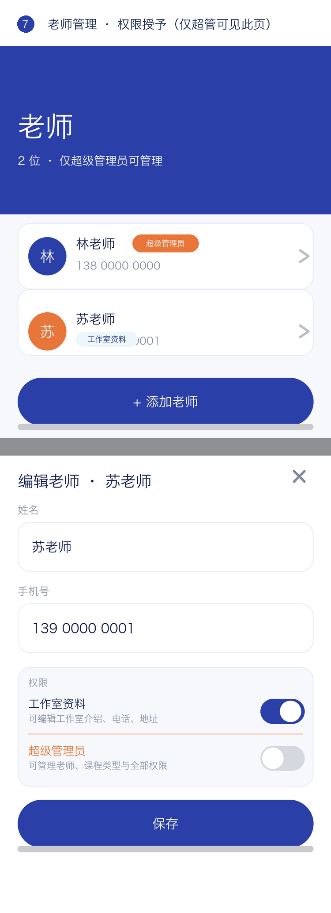

- 名单查询（姓名 / 手机号）+ 添加老师
- **只有超级管理员显示标签**，普通老师不打标签（避免视觉噪音）
- 权限授予：可单独开启「工作室资料」编辑权限
- 提升为超管时权限自动全开；降级时自动收回（防止"已降级却保留全部权力"）
- 保护：最后一个超管不可降级、不可删除

---

### 4.8 课程类型（仅超管）

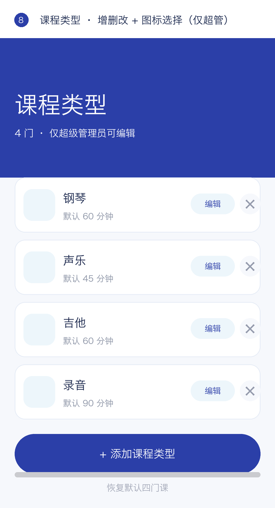

默认四门：**钢琴 / 声乐 / 吉他 / 录音**。可增删改，并可从 9 个手绘乐器图标中挑选。
修改后**排课页与学员约课页立即生效**（全站同一数据源）。

---

### 4.9 学员端


学员端工作台与老师端**共用同一套实体色块语言**（只有标题 + 卡通箭头，无图标圈、无说明小字）：

| 色块 | 配色 | 去向 |
|---|---|---|
| 立即约课 | 钴蓝 | 约课页 |
| 我的课表 | 浅蓝 | 我的课表 |
| 上课记录 | 陶土橙 | 课时档案与记录 |
| 我的 | 浅蓝 | 个人信息 / 工作室 |

色块下方保留「即将开始」列表，让学员打开就知道最近一节课是什么时候。

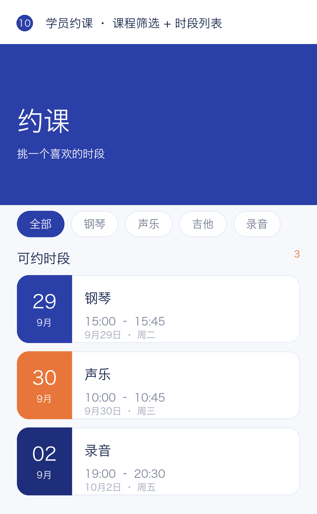
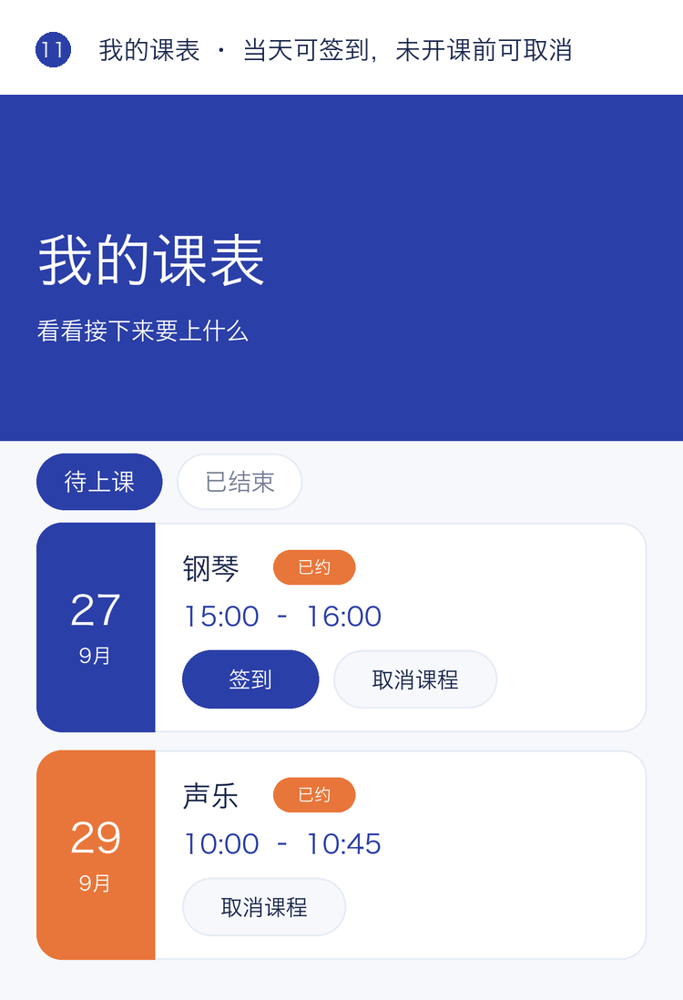

「我的课表」中，**当天的课**显示「签到」入口；未开课的课显示「取消课程」。

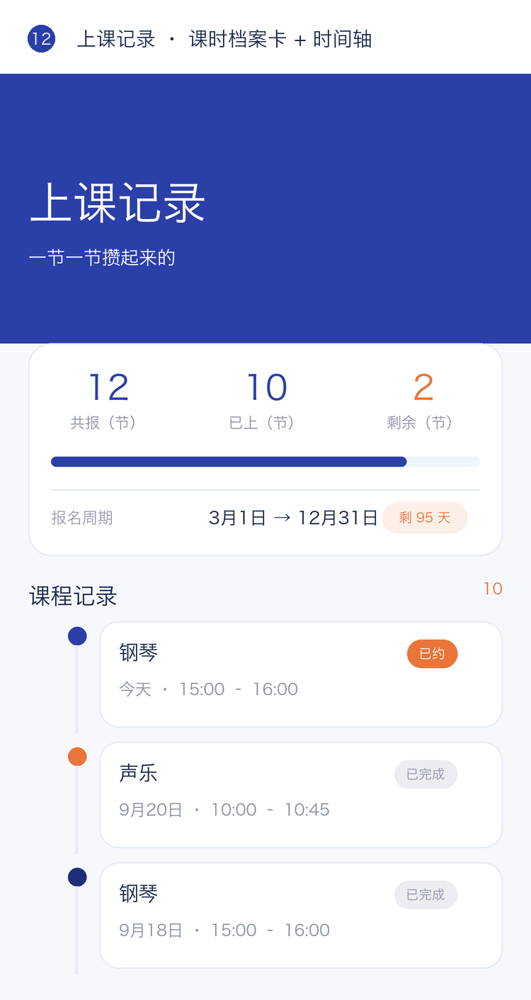

**课时档案卡**：共报 / 已上 / 剩余 + 进度条 + 报名周期（含剩余天数）。
老师没登记过课时和日期的学员，整卡隐藏，不留空壳。

---

### 4.10 我的 / 工作室信息

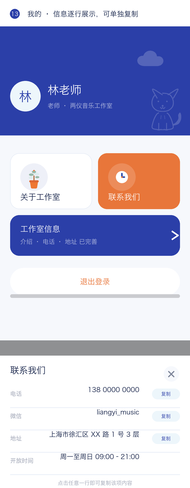
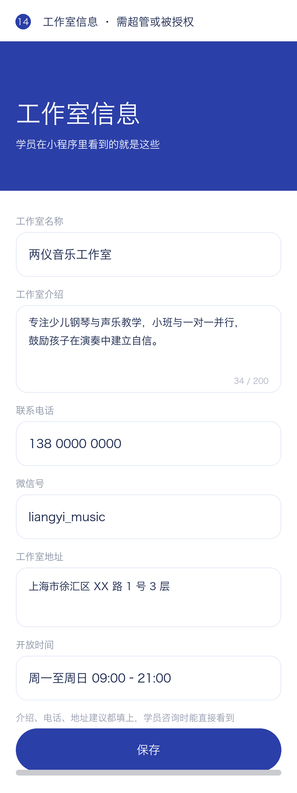

「关于工作室」「联系我们」用自定义弹层，**每条信息独立一行**、可单独复制。
「工作室信息」入口仅超管或被授权老师可见。

---

## 五、关键业务规则（产品视角）

| # | 规则 | 用户能感知到的表现 |
|---|---|---|
| 1 | 同课程类型时间互斥，不同类型可并行 | 排重了会提示"与 15:00–16:00 钢琴 重叠" |
| 2 | 同一学员不能同时段上两节课（跨类型也算） | 提示"学员「张小明」此时段已有 吉他 课" |
| 3 | 签到仅限当天或已开课（师生同规则） | 未来的课上看不到签到按钮 |
| 4 | 学员取消需距开课 > 6 小时 | 不足时弹窗引导联系老师并一键复制电话 |
| 5 | 老师取消不受时间限制 | — |
| 6 | 取消按是否下课分「释放 / 保留名单」 | 确认弹窗预先说明后果 |
| 7 | 已上 = 上线前录入 + 小程序内完成 | 老师填一次，之后自动累加 |
| 8 | 课时超支如实标红并提醒 | 学员端「已超 N 节」，老师签到当场弹窗提醒 |
| 9 | 固定课一次排 N 节，逐节独立校验 | 撞期那一周跳过并说明，其余正常排入 |

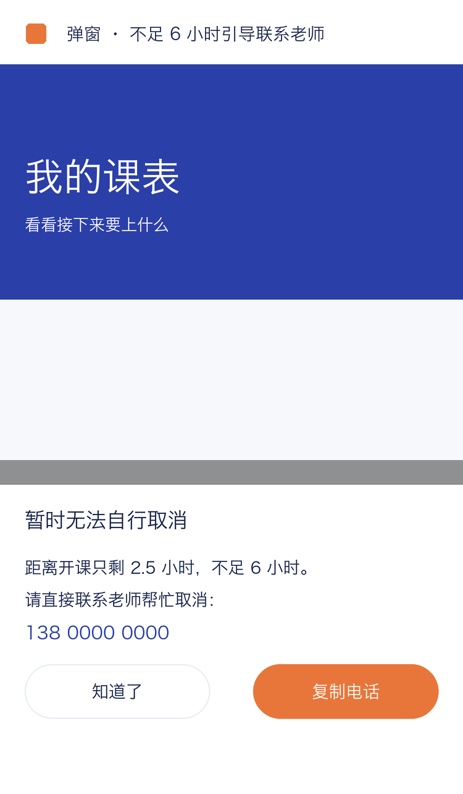

---

## 六、非功能需求

| 类别 | 要求 |
|---|---|
| 性能 | 首屏与页面切换 < 1s；本地缓存优先，弱网仍可用 |
| 兼容 | iOS / Android 微信；日期解析不使用 ISO 字符串（避免 iOS Invalid Date） |
| 一致 | 所有时间判断走同一套算法，界面与数据层不允许两套实现 |
| 可靠 | 操作只在真正成功时才提示成功；云端不可达时本地照常工作并在恢复后补同步 |
| 权限 | 服务端校验，不信任前端；非授权用户直接访问路径也会被拦下 |
| 隐私 | 手机号属敏感信息，须在小程序后台《用户隐私保护指引》中声明后方可收集 |
| 可维护 | 新增数据字段须同步递增种子版本号，老用户自动补齐且不覆盖其手工数据 |

---

## 七、里程碑

| 阶段 | 内容 | 状态 |
|---|---|---|
| M1 | UI 设计定稿 + 全部页面与业务规则实现（本地模式） | ✅ 已完成 |
| M2 | 注册小程序账号（建议个体工商户主体）、发起备案 | ⏳ 进行中 |
| M3 | 接入云开发，替换本地存储为云端同步 | ⏳ 待启动 |
| M4 | 体验版给工作室真实试用一轮 | ⏳ |
| M5 | 配置隐私指引与类目 → 提审发布 | ⏳ |

---

## 八、验收标准（走查清单）

- [ ] 首页两个色块按下有下沉与阴影压扁效果
- [ ] 未登录点首页返回不会误进工作台
- [ ] 老师登录只填手机号，全程不出现姓名与邀请码
- [ ] 学员登录第二步才要姓名；测试卡可一步进入
- [ ] 两端工作台色块尺寸、配色、箭头方向一致（同一套 `.tile` 组件）
- [ ] 排课：不同类型同时段可排；同类型被拦并说明原因
- [ ] 排课：同一学员两个时间重叠被拦
- [ ] 排课：30 分钟试课可自由设定起止时间
- [ ] 排课：每周 ×8 正确展开，节次标记显示，撞期那一周跳过并说明
- [ ] 约课管理：默认筛「今天」；双维筛选组合正确
- [ ] 约课管理：课卡显示起止时间与时长
- [ ] 约课管理：未来的课可以指定学员
- [ ] 签到：未来的课无入口，直接调用也被拒
- [ ] 签到：过去未签的课可补签
- [ ] 取消：未下课释放为待约；已下课保留名单
- [ ] 学员取消：< 6 小时被拦并给出老师电话与复制
- [ ] 学员端：共报 / 已上 / 剩余 / 进度 / 报名周期显示正确
- [ ] 学员端：超支显示「已超 N 节」，老师端签到后有提醒
- [ ] 学员管理：表单填的总已上与列表口径一致，不会跳数
- [ ] 老师管理：仅超管显示标签；权限开关联动正确
- [ ] 课程类型：改完学员端约课页同步生效
- [ ] 工作室信息：未授权进不去；填写后「关于 / 联系」显示真实内容
- [ ] 所有弹窗文案 ≤ 4 字且都能正常弹出

---

## 九、待确认问题

| # | 问题 | 影响 | 建议 |
|---|---|---|---|
| 1 | 超支时是否**阻止**签到？ | 目前是允许并提醒 | 工作室常口头加课，建议保持"允许 + 提醒" |
| 2 | 一节是否支持**多名学员**（小组课 / 合奏课）？ | 目前已支持多选 | 需与主理人确认是否要区分"一对一 / 小组" |
| 3 | 固定课是否需要**整组管理**（停掉某周 / 往后全部取消） | 目前只能逐节操作 | 建议 M3 后补 |
| 4 | 「我的」页是否也改成纯色块入口 | 目前仍是卡片式（带图标圈） | 与主理人确认后再动，避免一次性改太多 |
| 5 | 是否需要**上课提醒**（订阅消息） | 未实现 | 上线后看主理人是否常忘 |

---

## 十、变更记录

| 版本 | 日期 | 变更 |
|---|---|---|
| v1.0 | 2026-09-27 | 首版：产品概述、角色与场景、信息架构、14 页需求与原型图、业务规则、里程碑、验收清单 |
| v1.1 | 2026-09-27 | 原型图改为**直接引用线上真实插画素材**（约克夏、卡通箭头、太阳云朵），并按 `pages/index` 的实际几何重画首页（两个身份按钮左右并排）；学员端工作台统一为实体色块，补齐色块规格表与验收项 |
