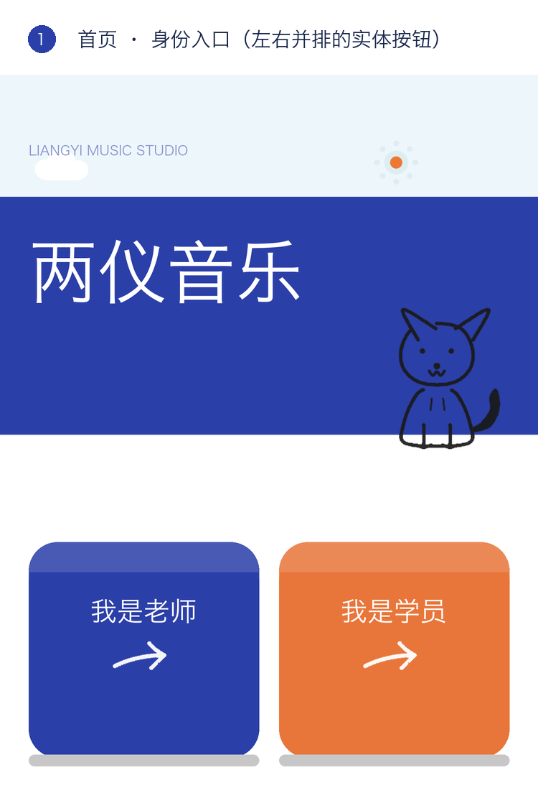
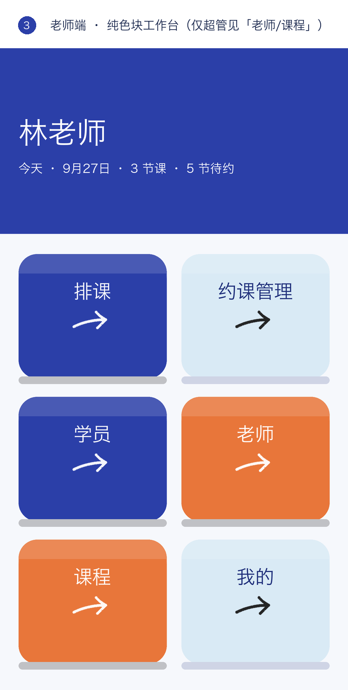
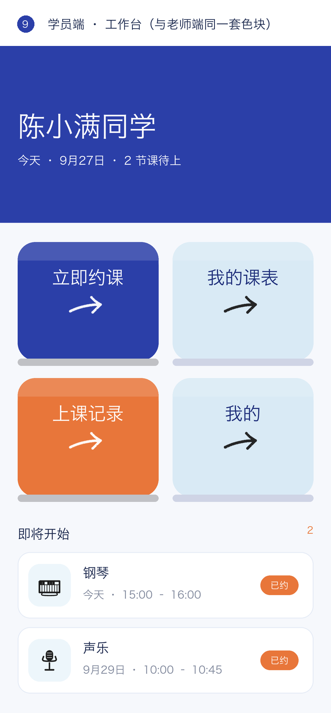

# 两仪音乐工作室小程序 · 详细设计文档

| 项 | 内容 |
|---|---|
| 文档版本 | v1.1（2026-09-27） |
| 对应代码 | `liangyi-music-studio/` |
| 关联文档 | [PRD.md](./PRD.md) · [云开发接入.md](../云开发接入.md) |

---

## 一、技术方案选型

### 1.1 技术栈

| 层 | 选型 | 理由 |
|---|---|---|
| 客户端 | **微信小程序原生**（WXML / WXSS / JS） | 单一目标平台，无需跨端；不引入 uni-app/Taro，减少构建链与体积 |
| 服务 | **微信云开发**（云函数 + 云数据库） | 免服务器、免域名、免域名备案；免费额度对单工作室足够 |
| 数据策略 | **本地优先 + 云端同步**（Local-first） | 页面同步读缓存保证秒开与离线可用；写操作本地立即生效、异步差分上云 |
| 图形资源 | **Pillow 直绘线条 PNG + base64 内联 WXSS** | 见 1.2 |
| 权限 | **云函数服务端校验** | 客户端 `wx:if` 仅用于界面显隐，不作为安全边界 |

### 1.2 关键技术决策与依据

**① 为什么插画不用 SVG**

实测渲染器（ImageMagick MSVG 与小程序侧）会**直接丢弃** `fill="none" stroke="..."` 的图形，
`transform="rotate()"` 同样不可靠。因此所有线条插画（约克夏、9 个乐器图标、卡通箭头）
改用 **Pillow 逐段绘制平滑折线**（Catmull-Rom 采样 + 圆头圆角），导出 PNG。

**② 为什么内联 base64 而不是图片文件**

WXSS 的 `background-image` 不支持本地相对路径。base64 内联后：
资源随样式表一次性加载、无额外请求、剪影/反色可各存一份。
全部资源量化后约 26 KB（`app.wxss` 共 63 KB）。

**③ 为什么日期一律拆数字构造**

`new Date('2026-09-28T10:00:00')` 在 iOS/JSC 上对**无时区 ISO 串**返回 `Invalid Date`，
`getTime()` 得 `NaN`，会让"能否签到""是否超 6 小时"等判断全部失效。
统一使用 `utils/date.js#toDate()` 拆字段构造，并对 `NaN` 兜底。

**④ 为什么弹窗要包一层 `utils/dialog.js`**

`wx.showModal` 的 `confirmText` / `cancelText` **超过 4 字会被静默拒绝**（弹窗不出现、无报错），
表现为"点了没反应"。封装后自动截断 + `console.warn` + 挂 `fail` 回调。
多行内容同理：`content` 不保证支持 `\n`，一律改用自定义底部弹层。

**⑤ 为什么种子数据要版本化**

`list()` 只在缓存为空时播种，导致**后来新增的字段永远到不了老设备**
（曾造成"课时档案卡只有部分学员显示"）。方案：`SEED_VER` + `upgrade()`，
只补**字段真正缺失**的记录（`0` 与 `''` 视为老师有意填写的合法值，不覆盖），
且 `upgrade()` 必须作用于**原始缓存**（先 `normalize` 会把字段补出来，导致无法区分）。

### 1.3 AI 工具链

| 环节 | 工具 | 用途 |
|---|---|---|
| 工程实现 | **Codex**（gpt-5.6-sol） | 架构设计、代码编写与重构、静态校验与回归测试脚本 |
| UI 设计 | **Qwen3.8-Flash** | 视觉方向与配色方案探索、界面布局与组件样式设计 |
| 辅助决策 | **DeepSeek-V4.1-Flash** | 交互细节推敲、边界场景与文案补充 |

> 说明：AI 产出的每一处改动均经过**代码级校验**（WXML 标签平衡、CSS 类引用、
> 事件函数存在性、require 路径有效性、JS 语法）与**行为测试**（Node + `wx` 存储桩，
> 真实执行 store 与云函数逻辑），不依赖人工目测。

---

## 二、角色和权限

### 2.1 角色定义

| 角色 | 标识 | 判定来源 |
|---|---|---|
| 游客 | `role === ''` | 无 session |
| 学员 | `role === 'student'` | 手机号**未**命中 `teachers` |
| 老师 | `role === 'teacher'` | 手机号命中 `teachers` |
| 超级管理员 | `isSuperAdmin === true` | `teachers.isSuperAdmin` |

### 2.2 权限模型

```js
// 单一权限点，可扩展
PERMS = [{ k: 'editStudio', t: '工作室资料', d: '可编辑工作室介绍、电话、地址' }]

// 判定：超管天然拥有全部
can(teacher, key) = teacher.isSuperAdmin || !!teacher.perms?.[key]
```

### 2.3 权限矩阵

| 能力 | 游客 | 学员 | 老师 | 超管 | 强制位置 |
|---|---|---|---|---|---|
| 登录 | ✅ | ✅ | ✅ | ✅ | — |
| 查看课表 / 约课 | ❌ | ✅ | ✅ | ✅ | `sync.pull` |
| 约 / 退自己的课 | ❌ | ✅(受限) | ✅ | ✅ | `sync.book` |
| 排课 / 改课 / 签到 / 取消 | ❌ | ❌ | ✅ | ✅ | `sync.push`（校验 role） |
| 学员增删改 | ❌ | ❌ | ✅ | ✅ | `sync.push` |
| 课程类型增删改 | ❌ |  | ❌ | ✅ | `admin`（校验 isSuperAdmin） |
| 老师管理 / 权限授予 | ❌ | ❌ |  | ✅ | `admin` |
| 工作室资料编辑 | ❌ | ❌ | 需授权 | ✅ | `app.can('editStudio')` + 页面守卫 |

### 2.4 身份链路（关键实现）

```
app.signIn({ role, userInfo, openid, isSuperAdmin, perms })
   └─► globalData + wx.setStorageSync('session')

学员身份 id（课表 students 里用的就是这个）：
app.getStudentId()
   ├─ userInfo.sid 存在 → 直接返回
   ├─ 否则按 phone 回查 students → 命中则回写 sid 到 session（自愈）
   ├─ 名册也没有 → students.add() 自动入册（备注「自助注册」）
   └─ 异常 → 退回 'p_' + phone，保证不串号

app.myStudentKeys() → [sid, openid, 'p_'+phone]
   └─ 匹配课表时任一命中即算"我的课"，兼容历史数据
```

### 2.5 服务端权限依据

`members` 集合**只由 `login` 云函数写入**（依据 openid + 手机号），客户端不可写。
`sync` / `admin` 云函数每次调用都先 `member(OPENID)` 查表判定角色，
不采信客户端传来的任何身份字段。

**冷启动**：`admin` 用 `BOOTSTRAP_ADMINS`（手机号白名单）引导出第一个超管，
之后一律按 `members.isSuperAdmin` 判定。

### 2.6 权限变更的四条保护规则

角色升降级会连带影响权限位，以下四条在 `teachers.setSuper() / setPerm() / remove()` 内强制：

| 规则 | 原因 |
|---|---|
| 超管的权限**不可单独收回** | 超管本就拥有全部权限，单独收回无意义，且会造成「是超管但某权限为 false」的状态矛盾 |
| **最后一个超管**不可降级、不可删除 | 否则会没人能再管理老师与权限，系统锁死 |
| 降级超管时**同步收回全部权限** | 这些权限当初是「因为是超管」才有的；不收回会出现「已降级却仍保留全部权力」的越权残留 |
| 提升为超管时自动全开权限 | 与 `can()` 的超管短路保持一致，界面开关也不会自相矛盾 |

页面侧另有守卫：`pages/teacher/teachers` 与 `course-types` 的 `onLoad` 校验 `isSuperAdmin`，
非超管即使手输路径也会被弹窗拦下退回；服务端同样按 `members` 二次校验，**不信任前端**。

---

## 三、前端 UI 设计

### 3.1 设计令牌（`app.wxss` CSS 变量）

```css
--cobalt:#2B3FA8  --cobalt-d:#1E2E7A  --white:#FFFFFF  --paper:#F6F8FC
--line:#E6ECF6    --sky:#D9EAF5       --sky-lt:#EDF6FB --terra:#E8763A
--navy:#16244A    --r-lg:36rpx --r-md:28rpx --r-sm:20rpx
```

占比原则：钴蓝 + 白为绝对主色；陶土橙为中等面积点缀（次级色块、状态标签、时长徽标）；
浅蓝小面积过渡；砖红 `#C0392B` **仅用于课时超支告警**。

### 3.2 组件体系

| 组件 | 类名 | 规格 |
|---|---|---|
| 顶带 | `.top` / `.nav` | 钴蓝，高 150rpx 起（含状态栏留白）；标题 64–72rpx |
| 功能色块 | `.tiles` / `.tile` | 高 268rpx，圆角 40rpx，**只有标题 + 卡通箭头**；定义在 `app.wxss`，首页 `.role`、老师端与学员端工作台共用 |
| 卡片 | `.blk` / `.card` / `.item` | 白底 + `2rpx solid var(--line)` 描边（不用阴影） |
| 状态标签 | `.tag` | 圆角胶囊 22rpx；`t-sky` 可约 / `t-terra` 已约 / `t-mute` 已完成 / `t-cobalt` 已取消 |
| 图标片 | `.item-chip` | 96rpx 圆角方块，底色 `--sky-lt`，内嵌 62rpx 线条图标 |
| 主按钮 | `.btn` | 高 108rpx 胶囊；`.btn-full` 满宽、`.btn-nowrap` 强制单行 |
| 表单 | `.field` / `.field-i` | 输入框**只给左右 padding**（上下 padding 会导致文字垂直位置漂移） |
| 多行输入 | `.ta-box > textarea` | padding 与边框放外层容器（原生 textarea 的 padding 不生效） |
| 底部弹层 | `.mask` + `.sheet` | 圆角 40rpx，最高 80–88vh |

### 3.3 实体按钮规格（首页与两端工作台入口）

```css
.tile {
  box-shadow: 0 16rpx 0 rgba(0,0,0,.22);          /* 无模糊＝按钮厚度 */
  transition: transform .11s cubic-bezier(.3,.7,.4,1), box-shadow .11s;
}
.tile::before { height:42rpx; background:rgba(255,255,255,.14); }  /* 顶部高光 */
.tile:active, .tile.tile-hover {
  transform: translateY(16rpx);                    /* 真的按下去 */
  box-shadow: 0 0 0 rgba(0,0,0,.22);               /* 厚度压扁 */
}
/* 浅蓝块需换深色调，否则白高光与黑阴影不可见 */
.b-light { box-shadow: 0 16rpx 0 rgba(30,46,122,.18); }
.b-light::before { background: rgba(30,46,122,.06); }
```

**双保险**：`hover-class="tile-hover"` + `hover-stay-time="90"`，
因部分安卓机型 `:active` 不触发。

### 3.4 图形资源清单（`assets/illustrations.wxss`）

| 类别 | 资源 |
|---|---|
| 插画（彩色） | `ill-dog` `ill-plant` `ill-sun` `ill-cloud` `ill-note` `ill-cal` `ill-user` `ill-clock` `ill-list` `ill-door` |
| 插画（白线水印） | `ill-dog-w` `ill-note-w` `ill-plant-w` `ill-cloud-w` `ill-cal-w` `ill-user-c` |
| 箭头 | `ill-arrow-w`（深底）`ill-arrow-b`（浅底） |
| 乐器图标 | `ic-piano` `ic-vocal` `ic-guitar` `ic-record` `ic-violin` `ic-drum` `ic-flute` `ic-theory` `ic-ear` |

源 SVG 保留在 `assets/*.svg`（纯填充、无 stroke/transform），
约克夏与箭头由 Pillow 直绘，脚本见 `tools/`。

### 3.5 数据源约定

页面**一律同步读 store**（本地缓存），不直接碰 `wx.cloud`：

```
utils/courses.js   课程类型（超管可增删改）
utils/students.js  学员名册 + 课时档案
utils/teachers.js  老师登记 + 权限
utils/lessons.js   课表 + 全部业务规则
utils/studio.js    工作室资料（单文档）
utils/quota.js     课时汇总/超支（同时依赖 students+lessons，独立成模块避免循环引用）
```

页面在 `onShow` 重新读取，保证跨页操作后回到本页即最新。

---

### 3.6 视觉基准（原型图与代码同源）

`docs/mockups/` 里的原型图不是手绘示意图，而是**用同一批素材按真实几何渲染**出来的：

| 手段 | 说明 |
|---|---|
| 1 rpx = 1 px | 画布宽 750，与小程序设计稿一一对应；2 倍超采样后缩到 50% 抗锯齿 |
| 素材复用 | `Screen.ill()` 直接读取 `images/*.png`（约克夏、卡通箭头、太阳、云朵），改素材后原型图自动跟着变 |
| 真实间距 | `.tiles` 的 44/32/268、首页 `.role` 的 300 高与左右并排，全部照 `app.wxss` / `index.wxss` 取值 |
| 自动裁切 | 渲染后按内容底部裁掉空白，避免原型图下方大片留白 |
| 生成脚本 | `tools/render_mockups.py`（组件库）+ `tools/build_prd_assets.py`（逐屏）+ `tools/build_flow.py`（流程图）+ `tools/build_overview.py`（总览） |

  

> 缺字形规避：Hiragino Sans GB 缺 `› ✓ ✕ ⭐ ⑪⑫⑬⑭`，脚本里这些符号一律**手绘**
> （`chevron()` / `xmark()` / `checkmark()` / 序号徽标），否则渲染成方框叉。

---

## 四、数据库设计

### 4.1 集合总览（云开发）

| 集合 | 用途 | 权限 | 写入方 |
|---|---|---|---|
| `teachers` | 老师登记表 | 仅管理端 | `admin` / `sync.push` |
| `members` | openid → 角色映射 | 仅管理端 | **仅 `login`** |
| `students` | 学员名册 | 仅管理端 | `sync.push` / `login`(自助注册) |
| `courses` | 课程类型 | 仅管理端 | `sync.push` |
| `lessons` | 课表 | 仅管理端 | `sync.push` / `sync.book` |
| `settings` | 工作室资料（单文档） | 仅管理端 | `sync.push` |

**主键约定**：所有记录自带业务 `id` 字段（如 `s1`、`L...`、`t...`），
**不使用云端 `_id` 作业务主键** —— 避免本地/云端 id 映射与幂等问题。
`sync` 云函数读写时会剔除 `_id`。

### 4.2 表结构

#### `teachers`
| 字段 | 类型 | 说明 |
|---|---|---|
| `id` | string | 业务主键 |
| `name` | string | 姓名（登录成功即取此值，无需本人填） |
| `phone` | string | 唯一，登录判定依据 |
| `isSuperAdmin` | bool | 超管标记 |
| `perms` | object | `{ editStudio: bool }` |

#### `members`（服务端权限唯一依据）
| 字段 | 类型 | 说明 |
|---|---|---|
| `openid` | string | 微信 openid，按 AppID 隔离 |
| `role` | `'teacher'│'student'` | 由 login 依手机号判定后写入 |
| `refId` | string | 指向 `teachers.id` 或 `students.id` |
| `name` `phone` | string | 冗余，便于展示 |
| `isSuperAdmin` | bool | 冗余自 teachers |

#### `students`
| 字段 | 类型 | 说明 |
|---|---|---|
| `id` `name` `phone` `note` | string | 基础信息 |
| `totalLessons` | number | 共报节数（上线前录入） |
| `doneBefore` | number | **基线**已上节数（上线前），展示值 = 基线 + 系统内 completed |
| `enrollStart` `enrollEnd` | string `YYYY-MM-DD` | 报名起止，可空 |

#### `courses`
| 字段 | 类型 | 说明 |
|---|---|---|
| `id` `name` | string | 课程类型 |
| `ill` | string | 图标 class 名（`ic-*`），全站唯一占用 |
| `duration` | number | 默认时长（分钟），10–480 |
| `sort` | number | 排序 |

#### `lessons`
| 字段 | 类型 | 说明 |
|---|---|---|
| `id` | string | 业务主键 |
| `date` | string | `YYYY-MM-DD` |
| `timeStart` `timeEnd` | string | `HH:MM`，自由时段 |
| `timeSlot` | string | 展示用 `start–end`，**读取时归一化生成** |
| `minutes` | number | 时长，缺失时由起止推算 |
| `courseType` `courseName` `ill` | string | 课程快照（改名后历史仍显示当时名称） |
| `booked` | bool | 是否已占用 |
| `students` | array | `[{id, name}]` 快照，支持多人（小组课） |
| `status` | enum | `available` / `booked` / `completed` / `cancelled` |
| `seriesId` | string | 固定课分组键，单节课为空 |
| `seriesLabel` `occurrence` | string | 「每周六 · 共 8 节」「3/8」 |
| `createdAt` | number/date | 创建时间 |

#### `settings`（单文档）
`{ id:'studio', name, intro, phone, address, wechat, hours }`

### 4.3 状态机

```
available ──指定/被约──► booked ──签到(当天或已开课)──► completed
    ▲                      │
    └── 取消(未下课,清学员) ─┤
                           └── 取消(已下课) ──► cancelled（保留 students）
```

---

## 五、后端接口设计

### 5.1 云函数清单

| 函数 | 动作 | 鉴权 | 说明 |
|---|---|---|---|
| `login` | — | 微信上下文 | 取 openid；解码手机号；判定角色；**写 members**；学员自助入册 |
| `sync` | `pull` | 任意已登录 | 按集合白名单分页拉全量 |
| `sync` | `push` | **仅 teacher** | 按 id 做 add / update / remove 差分写入 |
| `sync` | `book` | 任意已登录 | 学员自助约 / 退，**只能改自己的 students 条目** |
| `admin` | `addTeacher` | 仅超管 | 登记老师 |
| `admin` | `listTeachers` | 仅超管 | 老师列表 |
| `admin` | `removeTeacher` | 仅超管 | 移除老师 |

统一响应：`{ code: 0, data }` 成功；`{ code: 非0, message }` 失败。

### 5.2 `login`

```js
// 入参
{ code?: string, phone?: string, name?: string }
// 出参
{ openid, appid, unionid,
  phone?, role?: 'teacher'|'student', name?, refId?,
  isSuperAdmin?, perms?, memberId?, phoneError? }
```
逻辑：`code` → `cloud.openapi.phonenumber.getPhoneNumber` 换真实手机号
（或 `phone` 手动路径）→ 查 `teachers` → 命中即老师（姓名取登记表）；
未命中则学员，带 `name` 时查/建 `students` → 最后 upsert `members`。

### 5.3 `sync.pull`

```js
// 入参
{ action:'pull', payload: { names: ['teachers','students','courses','lessons','settings'] } }
// 出参
{ code:0, data: { lessons:[...], students:[...], ... } }   // 已剔除 _id
```
服务端 `count()` + `skip/limit(100)` 循环分页（客户端单次上限很低）。
集合不存在按空数组返回，客户端保留本地。

### 5.4 `sync.push`

```js
// 入参
{ action:'push', payload: { ops: [
    { coll:'lessons', add:[...], update:[...], remove:['id1','id2'] }
]}}
// 出参
{ code:0, data:{ pushed:['lessons', ...] } }   // 403 → 仅老师可写
```
写入用 `coll.doc(String(id)).set({data})`，**以业务 id 作 `_id` 保证幂等**；
失败回退 `add()`。删除忽略"文档不存在"错误。

### 5.5 `sync.book`（学员专用窄接口）

```js
// 入参
{ action:'book', payload: { lessonId:'L..', action:'add'|'remove', selfName:'张小明' } }
// 出参
{ code:0, data:{ added:{id,name} } }  或  { code:0, data:{ removed:'s1', ended:false } }
```
服务端约束（**不信任客户端**）：
- 只能写入调用者自己在 `members.refId` 的身份，无法加他人
- 只允许改 `students` / `booked` / `status` 三个字段
- 课程 `completed` / `cancelled` 时拒绝
- `remove` 时若已过结束时间 → 标 `cancelled` 并**保留原名单**；否则释放为 `available`

### 5.6 客户端同步层 `utils/cloudkit.js`

```js
register(name, {coll, read, write})   // store 注册
init()                                // 依 config.CLOUD_ENV 决定 cloud / local 模式
markDirty(name)                       // store 写本地后调用（只读身份直接跳过）
pullAll()                             // 启动拉全量 → hydrate → 触发 onPulled 钩子
flush()                               // 600ms 防抖，diff 出 add/update/remove 后 push
setWritable(bool)                     // 登录后按角色设置
bookRemote(lessonId, action, selfName)// 学员约/退专用通道
```

差分算法：`snap[name]` 存上次与云端一致的 JSON，按 `id` 比对得出增/改/删。
`pullAll` 回填后**不标脏**，避免回环推送。

---

## 六、异常边界设计

### 6.1 业务规则边界

| # | 场景 | 处理 | 实现 |
|---|---|---|---|
| B1 | 同课程类型时间重叠 | 拒绝并列出冲突课程 | `lessons.overlap()` |
| B2 | 不同类型同时段 | **允许**（不同老师并行） | 同上，`courseType` 不同即不冲突 |
| B3 | 同一学员跨类型时间重叠 | 拒绝，指名学员与撞的课 | `lessons.studentClash()` |
| B4 | 给未来的课签到 | 拒绝「只能签到当天或已开课的」 | `lessons.canCheckIn()` |
| B5 | 给过去的课签到 | **允许**（事后补签） | 同上 |
| B6 | 学员取消距开课 ≤ 6h | 拒绝 + 引导联系老师 + 复制电话 | `lessons.cancelByStudent()` |
| B7 | 取消未下课的课 | 释放为 `available`、清空学员 | `lessons.cancel()` |
| B8 | 取消已下课的课 | 标 `cancelled`、**保留学员名单** | 同上 |
| B9 | 重复取消 / 取消已完成 | 拒绝并说明 | 同上 |
| B10 | 已上 > 共报 | 不阻止，但红色「已超 N 节」+ 签到后弹窗提醒 | `quota.summary()` |
| B11 | 表单"已上"大于"共报" | 拒绝保存 | `students.js` 页面校验 |
| B12 | 报名结束早于开始 | 拒绝保存；picker `start` 已绑开始日期防选反 | `students.checkCounts()` |
| B13 | 固定课某周撞期 | 跳过该周并说明，其余正常排入 | `lessons.addMany()` 逐条校验 |
| B14 | 课程类型同名 / 图标占用 | 拒绝 | `courses.add/update()` |
| B15 | 删除最后一个超管 / 降级自己 | 拒绝 | `teachers.setSuper/remove()` |
| B16 | 超管单独收回自身权限 | 拒绝（超管天然全权） | `teachers.setPerm()` |

### 6.2 身份与数据一致性

| # | 场景 | 处理 |
|---|---|---|
| C1 | 旧 session 缺 `sid` | `getStudentId()` 按手机号回查并**回写**；查不到自动入册 |
| C2 | 学员改业务数据 | `setWritable(false)` 抑制通用 push，避免必然 403；走 `bookRemote` |
| C3 | 非授权直达工作室信息页 | `onLoad` 校验，弹窗拦下并 `navigateBack` |
| C4 | 课表存了 `null` 学员 | `snapshot()` 结果一律 `.filter(Boolean)`；seed 同样处理 |
| C5 | 老缓存缺新字段 | `SEED_VER` + `upgrade()` 按 id 补缺失（**只补 `undefined/null`，不覆盖 0 与 `''`**） |
| C6 | 云端数据缺 `timeSlot`/`minutes` | `list()` 读取时 `normalize()` 由起止时间推导 |
| C7 | 已登录访问首页 | `onShow` 自动 `reLaunch` 到对应工作台；未登录不跳（避免返回被弹回） |
| C8 | 页面间数据陈旧 | 所有页面 `onShow` 重新读取；`pullAll` 完成后回调重跑当前页 `onShow` |

### 6.3 平台兼容性

| # | 风险 | 对策 |
|---|---|---|
| P1 | `showModal` 按钮文案 > 4 字 → **静默失败** | `dialog.js` 自动截断 + warn + `fail` 回调 |
| P2 | `showModal.content` 不支持 `\n` | 多行内容一律自定义底部弹层，逐行渲染 |
| P3 | iOS `new Date(ISO)` → Invalid Date | `toDate()` 拆数字构造；`NaN` 兜底为 0 |
| P4 | `<input>` 上下 padding 致文字漂移 | 只给左右 padding，固定 height + line-height |
| P5 | 原生 `<textarea>` padding 不生效 | padding/边框放外层容器，textarea `padding:0` |
| P6 | SVG `stroke` / `transform` 被丢弃 | 线条图全部 Pillow 直绘 |
| P7 | WXSS 不支持本地图片路径 | base64 PNG 内联 |
| P8 | 部分安卓 `:active` 不触发 | 同时挂 `hover-class` |
| P9 | 云开发未初始化即 `require` | `api.js` 改惰性获取 `DB()` 并给出明确报错 |
| P10 | `wx.cloud` 不存在（旧基础库） | `cloudkit.init()` 捕获后降级为本地模式 |

### 6.4 失败与降级策略

| 层 | 失败表现 | 策略 |
|---|---|---|
| 云函数不可达 | `callFunction` reject | 本地读写照常，`console.warn`，下次 `flush` 自动重试（脏标记保留） |
| 拉取失败 | `code !== 0` | 保留本地缓存，界面不阻塞，`status.error` 可查 |
| 写入被拒（403） | 只读身份误触 | 通用 push 已抑制；若发生则提示并保留本地 |
| 部分批量失败 | 冲突若干条 | 成功项照常写入，失败项逐条列明原因 |
| 假成功 | — | **禁止**：所有写操作返回 `{ok, reason}`，仅在 `ok` 时提示成功 |

---

### 6.5 质量保障：静态校验 + 行为回归

| 层次 | 做法 |
|---|---|
| 静态 | `python3 tools/check_project.py`：页面四件套与 `app.json` 注册、WXML 标签配平、`bind*` 事件函数存在、`require` 路径有效、WXML 用到的类在 wxss 中存在、`showModal` 按钮文案 ≤ 4 字、`node --check` 全量 JS 语法 |
| 行为 | Node + `wx` 存储桩，真实执行 `utils/*.js` 与云函数：排课冲突、固定课展开、取消释放/保留名单、签到时间窗、课时超支、种子升级不覆盖老师数据、云端同步双写 |
| 视觉 | 原型图与代码同源渲染，改样式后重跑 `build_prd_assets.py` 即可对照 |

> 原则：**不靠目测判断"改好了"**。字符串替换后断言锚点命中，改完必跑静态校验。

---

## 附录：目录结构

```
liangyi-music-studio/
├── app.js / app.json / app.wxss
├── utils/      config · cloudkit · constants · date · dialog ·
│               courses · students · teachers · lessons · studio · quota · api
├── pages/
│   ├── index · login · profile
│   ├── teacher/ home · schedule · bookings · students · teachers · course-types · studio
│   └── student/ home · book · schedule · records
├── cloudfunctions/  login · sync · admin
├── assets/          *.svg 源文件 + illustrations.wxss（base64）
├── images/          导出的 PNG
├── tools/           render_mockups · build_prd_assets · build_flow
│                    build_overview · check_project（静态校验）
└── docs/            PRD.md · 详细设计文档.md · mockups/（19 张原型图 + 流程图）

---

| 版本 | 日期 | 变更 |
|---|---|---|
| v1.0 | 2026-09-27 | 首版：技术方案选型（含 AI 工具链）、角色与权限、前端 UI、数据库、后端接口、异常边界 |
| v1.1 | 2026-09-27 | `.tiles/.tile` 上收为 `app.wxss` 全站共享组件，首页与两端工作台统一实体色块；新增 3.6 视觉基准（原型图与代码同源）与 6.5 质量保障（`tools/check_project.py`） |
